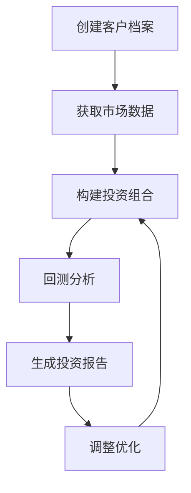

# 📚 Financial Advisor AI Copilot - API参考文档

## 🔧 MCP工具API参考

本文档详细描述了金融顾问AI助手提供的所有MCP工具的接口规范。

## 🛠️ 工具列表

### 1. create_client_profile

创建新的客户投资档案。

#### 参数

| 参数名 | 类型 | 必需 | 描述 |
|--------|------|------|------|
| `name` | string | ✅ | 客户姓名 |
| `age` | integer | ✅ | 客户年龄 (18-100) |
| `risk_tolerance` | string | ✅ | 风险承受能力 ("conservative", "moderate", "aggressive") |
| `investment_horizon` | integer | ✅ | 投资期限（年） |
| `monthly_income` | number | ✅ | 月收入 |
| `investment_goals` | array[string] | ❌ | 投资目标列表 |
| `existing_assets` | object | ❌ | 现有资产配置 |

#### 示例请求

```json
{
  "name": "张三",
  "age": 35,
  "risk_tolerance": "moderate",
  "investment_horizon": 10,
  "monthly_income": 15000.0,
  "investment_goals": ["retirement", "wealth_growth"],
  "existing_assets": {
    "cash": 50000,
    "stocks": 100000,
    "bonds": 30000
  }
}
```

#### 示例响应

```json
{
  "status": "success",
  "client_id": "client_12345",
  "profile": {
    "name": "张三",
    "risk_score": 6,
    "recommended_allocation": {
      "stocks": 0.6,
      "bonds": 0.3,
      "cash": 0.1
    },
    "investment_capacity": 120000
  },
  "message": "客户档案创建成功"
}
```

---

### 2. get_market_data

获取指定股票的市场数据。

#### 参数

| 参数名 | 类型 | 必需 | 描述 |
|--------|------|------|------|
| `symbols` | array[string] | ✅ | 股票代码列表 |
| `period` | string | ❌ | 数据周期 ("1d", "5d", "1mo", "3mo", "6mo", "1y", "2y", "5y", "10y", "ytd", "max") |
| `interval` | string | ❌ | 数据间隔 ("1m", "2m", "5m", "15m", "30m", "60m", "90m", "1h", "1d", "5d", "1wk", "1mo", "3mo") |

#### 示例请求

```json
{
  "symbols": ["AAPL", "GOOGL", "MSFT"],
  "period": "1mo",
  "interval": "1d"
}
```

#### 示例响应

```json
{
  "status": "success",
  "data": {
    "AAPL": {
      "current_price": 175.43,
      "change": 2.15,
      "change_percent": 1.24,
      "volume": 45678900,
      "market_cap": 2750000000000,
      "pe_ratio": 28.5,
      "historical_data": [
        {
          "date": "2024-01-01",
          "open": 170.00,
          "high": 176.00,
          "low": 169.50,
          "close": 175.43,
          "volume": 45678900
        }
      ]
    }
  },
  "timestamp": "2024-01-15T10:30:00Z"
}
```

---

### 3. build_portfolio

基于客户档案构建优化投资组合。

#### 参数

| 参数名 | 类型 | 必需 | 描述 |
|--------|------|------|------|
| `client_name` | string | ✅ | 客户姓名 |
| `symbols` | array[string] | ✅ | 候选股票列表 |
| `investment_amount` | number | ✅ | 投资金额 |
| `risk_level` | string | ❌ | 风险等级覆盖 |
| `constraints` | object | ❌ | 投资约束条件 |

#### 示例请求

```json
{
  "client_name": "张三",
  "symbols": ["AAPL", "GOOGL", "MSFT", "SPY", "BND"],
  "investment_amount": 100000,
  "risk_level": "moderate",
  "constraints": {
    "max_single_position": 0.3,
    "min_diversification": 3,
    "sector_limits": {
      "technology": 0.6
    }
  }
}
```

#### 示例响应

```json
{
  "status": "success",
  "portfolio": {
    "client_name": "张三",
    "total_investment": 100000,
    "allocations": [
      {
        "symbol": "AAPL",
        "weight": 0.25,
        "amount": 25000,
        "shares": 142
      },
      {
        "symbol": "GOOGL",
        "weight": 0.20,
        "amount": 20000,
        "shares": 14
      },
      {
        "symbol": "MSFT",
        "weight": 0.20,
        "amount": 20000,
        "shares": 53
      },
      {
        "symbol": "SPY",
        "weight": 0.25,
        "amount": 25000,
        "shares": 52
      },
      {
        "symbol": "BND",
        "weight": 0.10,
        "amount": 10000,
        "shares": 123
      }
    ],
    "expected_return": 0.12,
    "expected_volatility": 0.18,
    "sharpe_ratio": 0.67,
    "diversification_score": 0.85
  },
  "rationale": "基于客户的中等风险偏好，构建了平衡的股债组合..."
}
```

---

### 4. adjust_portfolio

根据自然语言指令调整投资组合。

#### 参数

| 参数名 | 类型 | 必需 | 描述 |
|--------|------|------|------|
| `portfolio_id` | string | ✅ | 投资组合ID |
| `instructions` | string | ✅ | 调整指令（自然语言） |
| `client_name` | string | ❌ | 客户姓名 |

#### 示例请求

```json
{
  "portfolio_id": "portfolio_12345",
  "instructions": "我觉得科技股风险太高了，请减少苹果和谷歌的配置，增加一些债券",
  "client_name": "张三"
}
```

#### 示例响应

```json
{
  "status": "success",
  "adjustments": {
    "original_portfolio": {
      "AAPL": 0.25,
      "GOOGL": 0.20,
      "MSFT": 0.20,
      "SPY": 0.25,
      "BND": 0.10
    },
    "adjusted_portfolio": {
      "AAPL": 0.15,
      "GOOGL": 0.10,
      "MSFT": 0.20,
      "SPY": 0.25,
      "BND": 0.20,
      "TLT": 0.10
    },
    "changes": [
      {
        "symbol": "AAPL",
        "old_weight": 0.25,
        "new_weight": 0.15,
        "change": -0.10,
        "reason": "减少科技股风险敞口"
      },
      {
        "symbol": "GOOGL",
        "old_weight": 0.20,
        "new_weight": 0.10,
        "change": -0.10,
        "reason": "减少科技股风险敞口"
      },
      {
        "symbol": "BND",
        "old_weight": 0.10,
        "new_weight": 0.20,
        "change": 0.10,
        "reason": "增加债券配置以降低风险"
      },
      {
        "symbol": "TLT",
        "old_weight": 0.00,
        "new_weight": 0.10,
        "change": 0.10,
        "reason": "新增长期国债配置"
      }
    ]
  },
  "impact_analysis": {
    "expected_return_change": -0.015,
    "volatility_change": -0.025,
    "sharpe_ratio_change": 0.05
  },
  "explanation": "根据您的指令，我减少了苹果和谷歌的配置各10%，并相应增加了债券配置..."
}
```

---

### 5. backtest_portfolio

对投资组合进行历史回测分析。

#### 参数

| 参数名 | 类型 | 必需 | 描述 |
|--------|------|------|------|
| `symbols` | array[string] | ✅ | 股票代码列表 |
| `weights` | array[number] | ✅ | 权重列表（需要与symbols对应） |
| `start_date` | string | ✅ | 回测开始日期 (YYYY-MM-DD) |
| `end_date` | string | ✅ | 回测结束日期 (YYYY-MM-DD) |
| `initial_investment` | number | ✅ | 初始投资金额 |
| `rebalance_frequency` | string | ❌ | 再平衡频率 ("monthly", "quarterly", "annually") |
| `benchmark` | string | ❌ | 基准指数 (默认: "SPY") |

#### 示例请求

```json
{
  "symbols": ["AAPL", "GOOGL", "MSFT"],
  "weights": [0.4, 0.3, 0.3],
  "start_date": "2023-01-01",
  "end_date": "2024-01-01",
  "initial_investment": 100000,
  "rebalance_frequency": "quarterly",
  "benchmark": "SPY"
}
```

#### 示例响应

```json
{
  "status": "success",
  "backtest_results": {
    "period": {
      "start_date": "2023-01-01",
      "end_date": "2024-01-01",
      "duration_days": 365
    },
    "performance": {
      "total_return": 0.156,
      "annualized_return": 0.156,
      "volatility": 0.185,
      "sharpe_ratio": 0.84,
      "max_drawdown": -0.125,
      "calmar_ratio": 1.25,
      "sortino_ratio": 1.12,
      "final_value": 115600
    },
    "benchmark_comparison": {
      "benchmark_return": 0.098,
      "alpha": 0.058,
      "beta": 1.15,
      "tracking_error": 0.045,
      "information_ratio": 1.29
    },
    "monthly_returns": [
      {"month": "2023-01", "return": 0.045},
      {"month": "2023-02", "return": -0.012},
      {"month": "2023-03", "return": 0.028}
    ],
    "portfolio_value_history": [
      {"date": "2023-01-01", "value": 100000},
      {"date": "2023-01-31", "value": 104500},
      {"date": "2023-02-28", "value": 103244}
    ],
    "risk_metrics": {
      "var_95": -0.032,
      "cvar_95": -0.048,
      "maximum_drawdown_duration": 45
    }
  },
  "analysis": "该投资组合在2023年表现优异，年化收益率15.6%，显著跑赢基准..."
}
```

---

### 6. generate_investment_report

生成综合投资报告。

#### 参数

| 参数名 | 类型 | 必需 | 描述 |
|--------|------|------|------|
| `client_name` | string | ✅ | 客户姓名 |
| `portfolio_symbols` | array[string] | ✅ | 投资组合股票列表 |
| `portfolio_weights` | array[number] | ✅ | 投资组合权重 |
| `report_type` | string | ❌ | 报告类型 ("summary", "comprehensive", "risk_analysis") |
| `include_charts` | boolean | ❌ | 是否包含图表 |
| `language` | string | ❌ | 报告语言 ("zh", "en") |

#### 示例请求

```json
{
  "client_name": "张三",
  "portfolio_symbols": ["AAPL", "GOOGL", "MSFT", "SPY"],
  "portfolio_weights": [0.3, 0.25, 0.25, 0.2],
  "report_type": "comprehensive",
  "include_charts": true,
  "language": "zh"
}
```

#### 示例响应

```json
{
  "status": "success",
  "report": {
    "report_id": "report_12345",
    "client_name": "张三",
    "generation_date": "2024-01-15T10:30:00Z",
    "report_type": "comprehensive",
    "sections": {
      "executive_summary": {
        "title": "投资组合执行摘要",
        "content": "基于您的投资目标和风险偏好，我们为您构建了一个平衡的投资组合...",
        "key_metrics": {
          "expected_return": "12.5%",
          "risk_level": "中等",
          "diversification_score": "85%"
        }
      },
      "portfolio_analysis": {
        "title": "投资组合分析",
        "asset_allocation": [
          {"asset": "AAPL", "weight": "30%", "sector": "科技", "rationale": "优质成长股"},
          {"asset": "GOOGL", "weight": "25%", "sector": "科技", "rationale": "搜索和云计算龙头"},
          {"asset": "MSFT", "weight": "25%", "sector": "科技", "rationale": "企业软件领导者"},
          {"asset": "SPY", "weight": "20%", "sector": "多元化", "rationale": "市场基准配置"}
        ],
        "sector_distribution": {
          "科技": "80%",
          "多元化": "20%"
        }
      },
      "risk_analysis": {
        "title": "风险分析",
        "risk_metrics": {
          "portfolio_volatility": "18.5%",
          "max_drawdown": "12.5%",
          "var_95": "3.2%"
        },
        "risk_factors": [
          "科技股集中度较高",
          "对市场整体走势敏感",
          "汇率风险（美股投资）"
        ],
        "mitigation_strategies": [
          "定期再平衡",
          "分批建仓",
          "关注宏观经济指标"
        ]
      },
      "performance_projection": {
        "title": "业绩预测",
        "scenarios": {
          "optimistic": {"return": "18%", "probability": "25%"},
          "base_case": {"return": "12%", "probability": "50%"},
          "pessimistic": {"return": "6%", "probability": "25%"}
        }
      },
      "recommendations": {
        "title": "投资建议",
        "short_term": [
          "关注Q4财报季表现",
          "监控美联储政策变化"
        ],
        "long_term": [
          "保持长期投资视角",
          "适时增加国际化配置"
        ],
        "rebalancing": {
          "frequency": "季度",
          "triggers": ["权重偏离超过5%", "基本面重大变化"]
        }
      }
    },
    "charts": [
      {
        "type": "pie_chart",
        "title": "资产配置分布",
        "data_url": "/charts/allocation_pie_12345.png"
      },
      {
        "type": "line_chart",
        "title": "历史表现对比",
        "data_url": "/charts/performance_line_12345.png"
      }
    ],
    "pdf_url": "/reports/comprehensive_report_12345.pdf",
    "expires_at": "2024-02-15T10:30:00Z"
  },
  "message": "投资报告生成成功"
}
```

## 🔒 错误处理

### 标准错误响应格式

```json
{
  "status": "error",
  "error_code": "INVALID_PARAMETER",
  "message": "参数验证失败",
  "details": {
    "field": "age",
    "reason": "年龄必须在18-100之间"
  },
  "timestamp": "2024-01-15T10:30:00Z"
}
```

### 常见错误代码

| 错误代码 | 描述 | 解决方案 |
|----------|------|----------|
| `INVALID_PARAMETER` | 参数验证失败 | 检查参数格式和取值范围 |
| `CLIENT_NOT_FOUND` | 客户档案不存在 | 先创建客户档案 |
| `MARKET_DATA_ERROR` | 市场数据获取失败 | 检查网络连接和API配额 |
| `PORTFOLIO_BUILD_ERROR` | 投资组合构建失败 | 检查股票代码和投资金额 |
| `BACKTEST_ERROR` | 回测计算失败 | 检查日期范围和历史数据可用性 |
| `RATE_LIMITED` | API调用频率超限 | 等待后重试或升级API套餐 |
| `INSUFFICIENT_DATA` | 数据不足 | 调整时间范围或选择其他股票 |
| `OPTIMIZATION_FAILED` | 投资组合优化失败 | 放宽约束条件或增加候选资产 |

## 📊 数据模型

### ClientProfile

```python
class ClientProfile(BaseModel):
    name: str
    age: int  # 18-100
    risk_tolerance: str  # "conservative", "moderate", "aggressive"
    investment_horizon: int  # 投资期限（年）
    monthly_income: float
    investment_goals: List[str]
    existing_assets: Dict[str, float]
```

### PortfolioAllocation

```python
class PortfolioAllocation(BaseModel):
    assets: List[str]  # 资产代码列表
    weights: List[float]  # 权重列表（和为1.0）
    expected_return: float  # 预期年化收益率
    risk_level: str  # 风险等级
    rebalance_frequency: str  # 再平衡频率
```

### BacktestResult

```python
class BacktestResult(BaseModel):
    start_date: datetime
    end_date: datetime
    total_return: float  # 总收益率
    annual_return: float  # 年化收益率
    volatility: float  # 波动率
    sharpe_ratio: float  # 夏普比率
    max_drawdown: float  # 最大回撤
    portfolio_value: List[float]  # 组合价值历史
    benchmark_return: float  # 基准收益率
```

## 🔄 使用流程

### 典型工作流程



### 代码示例

#### Python客户端示例

```python
import asyncio
from mcp import ClientSession, StdioServerParameters
from mcp.client.stdio import stdio_client

async def financial_advisor_workflow():
    server_params = StdioServerParameters(
        command="python",
        args=["main.py"]
    )
    
    async with stdio_client(server_params) as (read, write):
        async with ClientSession(read, write) as session:
            await session.initialize()
            
            # 1. 创建客户档案
            profile_result = await session.call_tool("create_client_profile", {
                "name": "张三",
                "age": 35,
                "risk_tolerance": "moderate",
                "investment_horizon": 10,
                "monthly_income": 15000.0,
                "investment_goals": ["retirement", "wealth_growth"]
            })
            
            # 2. 构建投资组合
            portfolio_result = await session.call_tool("build_portfolio", {
                "client_name": "张三",
                "symbols": ["AAPL", "GOOGL", "MSFT", "SPY"],
                "investment_amount": 100000,
                "risk_level": "moderate"
            })
            
            # 3. 回测分析
            backtest_result = await session.call_tool("backtest_portfolio", {
                "symbols": ["AAPL", "GOOGL", "MSFT", "SPY"],
                "weights": [0.3, 0.25, 0.25, 0.2],
                "start_date": "2023-01-01",
                "end_date": "2024-01-01",
                "initial_investment": 100000
            })
            
            # 4. 生成报告
            report_result = await session.call_tool("generate_investment_report", {
                "client_name": "张三",
                "portfolio_symbols": ["AAPL", "GOOGL", "MSFT", "SPY"],
                "portfolio_weights": [0.3, 0.25, 0.25, 0.2],
                "report_type": "comprehensive"
            })

if __name__ == "__main__":
    asyncio.run(financial_advisor_workflow())
```

## 🔧 配置选项

### 环境变量

| 变量名 | 默认值 | 描述 |
|--------|--------|------|
| `ALPHA_VANTAGE_API_KEY` | - | Alpha Vantage API密钥 |
| `FINNHUB_API_KEY` | - | Finnhub API密钥 |
| `DEFAULT_RISK_FREE_RATE` | 0.02 | 无风险利率 |
| `CACHE_TTL` | 300 | 缓存过期时间（秒） |
| `MAX_PORTFOLIO_SIZE` | 20 | 最大投资组合资产数量 |
| `MIN_INVESTMENT_AMOUNT` | 1000 | 最小投资金额 |

### 风险等级映射

| 风险等级 | 股票比例 | 债券比例 | 现金比例 | 预期收益 | 预期波动 |
|----------|----------|----------|----------|----------|----------|
| conservative | 30% | 60% | 10% | 6-8% | 8-12% |
| moderate | 60% | 30% | 10% | 8-12% | 12-18% |
| aggressive | 80% | 15% | 5% | 12-16% | 18-25% |

## 📈 性能指标说明

### 收益指标

- **总收益率**: (期末价值 - 期初价值) / 期初价值
- **年化收益率**: (1 + 总收益率)^(1/年数) - 1
- **超额收益**: 投资组合收益率 - 基准收益率

### 风险指标

- **波动率**: 收益率的标准差（年化）
- **最大回撤**: 从峰值到谷值的最大跌幅
- **VaR**: 在给定置信水平下的最大可能损失
- **CVaR**: 超过VaR的条件期望损失

### 风险调整收益指标

- **夏普比率**: (投资组合收益率 - 无风险利率) / 投资组合波动率
- **索提诺比率**: (投资组合收益率 - 无风险利率) / 下行波动率
- **卡尔马比率**: 年化收益率 / 最大回撤
- **信息比率**: 超额收益 / 跟踪误差

## 🚀 最佳实践

### 1. 错误处理

```python
try:
    result = await session.call_tool("get_market_data", {
        "symbols": ["AAPL"],
        "period": "1mo"
    })
except Exception as e:
    if "Rate limited" in str(e):
        # 处理速率限制
        await asyncio.sleep(60)
        # 重试
    elif "Invalid symbol" in str(e):
        # 处理无效股票代码
        pass
```

### 2. 批量处理

```python
# 分批处理大量股票
symbols = ["AAPL", "GOOGL", "MSFT", ...]  # 100个股票
batch_size = 10

for i in range(0, len(symbols), batch_size):
    batch = symbols[i:i+batch_size]
    result = await session.call_tool("get_market_data", {
        "symbols": batch,
        "period": "1mo"
    })
    await asyncio.sleep(1)  # 避免速率限制
```

### 3. 缓存策略

```python
import time
from functools import lru_cache

@lru_cache(maxsize=100)
def cached_market_data(symbols_tuple, period, timestamp):
    # 基于时间戳的缓存，避免过期数据
    pass

# 使用5分钟缓存
cache_key = (tuple(symbols), period, int(time.time() // 300))
data = cached_market_data(cache_key)
```

## 📞 技术支持

### 常见问题

**Q: 为什么市场数据获取失败？**
A: 可能是API速率限制或网络问题。请检查API配额并稍后重试。

**Q: 投资组合优化失败怎么办？**
A: 检查约束条件是否过于严格，或增加候选资产数量。

**Q: 如何提高回测准确性？**
A: 使用更长的历史数据期间，考虑交易成本和滑点。

**Q: 报告生成很慢怎么办？**
A: 可以选择"summary"类型报告，或关闭图表生成。

### 联系方式

- 📧 技术支持: support@financial-advisor-ai.com
- 📚 文档: https://docs.financial-advisor-ai.com
- 🐛 问题反馈: https://github.com/your-repo/issues

---

**API参考文档 v1.0 | 更新时间: 2025-01-15**
